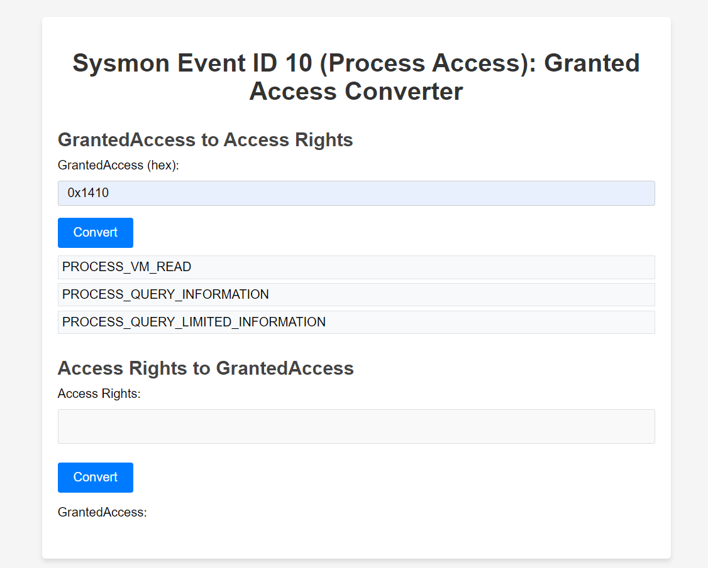

# Sysmon Granted Access Converter

The Granted Access Converter is a utility designed to help users understand and interpret the `GrantedAccess` values
found in Sysmon Event ID 10 logs. It allows users to convert the hexadecimal `GrantedAccess` values into human-readable
access rights and vice versa, providing valuable insights into the specific permissions granted during process access
events.



## Features

- Convert `GrantedAccess` values from hexadecimal to a list of access rights
- Convert a list of access rights to a `GrantedAccess` hexadecimal value

## How to Use the Granted Access Tool Converter

### Converting `GrantedAccess` to Access Rights

1. Enter the `GrantedAccess` value as a hexadecimal number (e.g., `0x1410`).
2. Click the "Convert" button.
3. The tool will display the corresponding access rights in a list format.

### Converting Access Rights to `GrantedAccess`

1. Select the desired access rights from the multi-select dropdown menu. You can choose multiple access rights by
   clicking on them or using the search functionality to find specific rights.
2. Click the "Convert" button.
3. The tool will display the corresponding `GrantedAccess` value as a hexadecimal number (e.g., `0x1410`).

By using the Granted Access Tool Converter, users can quickly analyze and understand the `GrantedAccess` values in
Sysmon Event ID 10 logs, enabling them to identify potentially malicious activities and investigate security incidents
more effectively.

### Recommended Detections

| TTP | TTP Name | Granted Access Codes               |
|-----|----------|------------------------------------|
|T1134.001| Access Token Manipulation: Token Impersonation/Theft | 0x440, 0x1410 |


## Sysmon Event ID 10: Process Access

Sysmon Event ID 10, also known as the Process Access event, is generated when a process attempts to access another
process. This event provides valuable information about the actions of running processes, which can help identify
potential security issues, monitor process interactions, and investigate malicious activities.

Process Access events are particularly useful in detecting unauthorized access, privilege escalation attempts, and
process injection techniques commonly used by malware.

## Key Fields in Event ID 10

[Sysmon Event ID 10 Documentation](https://www.ultimatewindowssecurity.com/securitylog/encyclopedia/event.aspx?eventid=90010)

Some of the key fields are:

- **SourceProcessGUID**: A unique identifier for the process that is attempting to access the target process.
- **SourceProcessId**: The process ID of the source process.
- **SourceImage**: The file path of the executable file of the source process.
- **TargetProcessGUID**: A unique identifier for the target process being accessed.
- **TargetProcessId**: The process ID of the target process.
- **TargetImage**: The file path of the executable file of the target process.
- **GrantedAccess**: The access rights granted to the source process for accessing the target process.
- **CallTrace**: A list of addresses in the source process that shows the function call sequence leading to the access
  request.

Sysmon Event ID 10 enables security analysts and administrators to monitor processes for suspicious activities,
investigate incidents, and establish baselines for normal behavior. By analyzing Process Access events, organizations
can strengthen their security posture and enhance their ability to detect and respond to threats.

## Configuring Sysmon to Log Event ID 10

To enable Sysmon to log Process Access events (Event ID 10), you need to modify the Sysmon configuration file. In the
configuration file, add the following entry within the `<Sysmon>` tag:

```xml

<ProcessAccess onmatch="include">
    <!-- Include rules for specific processes, images, or access rights -->
</ProcessAccess>
```

## Analyzing Sysmon Event ID 10

Analyzing Sysmon Event ID 10 logs can help identify potentially malicious activity or unauthorized access attempts. Some
common indicators to look for include:

### 1. Unusual source or target processes

Monitoring processes that are not typically involved in process access events can help identify suspicious activity.

### 2. Unexpected access rights

High-level access rights, such as PROCESS_ALL_ACCESS, might indicate an attempt to gain unauthorized control over a
process.

### 3. Unusual call traces

Analyzing the call trace can help identify potential code injection or process manipulation.

By monitoring and analyzing Sysmon Event ID 10 logs, organizations can gain insight into process interactions and detect
potential security threats, ultimately improving their overall security posture.

## Contribute

In order to contribute to this project please contact the MAINTAINER [Yusuf Khan](https://github.com/yukh1402) under
following email address ykhan@rukhsarkhan.de .

## LICENSE

Copyright (c) 2023 Yusuf Khan

Permission is hereby granted, free of charge, to any person obtaining a copy of this software and associated documentation files (the “Software”), to deal in the Software without restriction, including without limitation the rights to use, copy, modify, merge, publish, distribute, sublicense, and/or sell copies of the Software, and to permit persons to whom the Software is furnished to do so, subject to the following conditions:

The above copyright notice and this permission notice shall be included in all copies or substantial portions of the Software.

THE SOFTWARE IS PROVIDED “AS IS”, WITHOUT WARRANTY OF ANY KIND, EXPRESS OR IMPLIED, INCLUDING BUT NOT LIMITED TO THE WARRANTIES OF MERCHANTABILITY, FITNESS FOR A PARTICULAR PURPOSE AND NONINFRINGEMENT. IN NO EVENT SHALL THE AUTHORS OR COPYRIGHT HOLDERS BE LIABLE FOR ANY CLAIM, DAMAGES OR OTHER LIABILITY, WHETHER IN AN ACTION OF CONTRACT, TORT OR OTHERWISE, ARISING FROM, OUT OF OR IN CONNECTION WITH THE SOFTWARE OR THE USE OR OTHER DEALINGS IN THE SOFTWARE.

